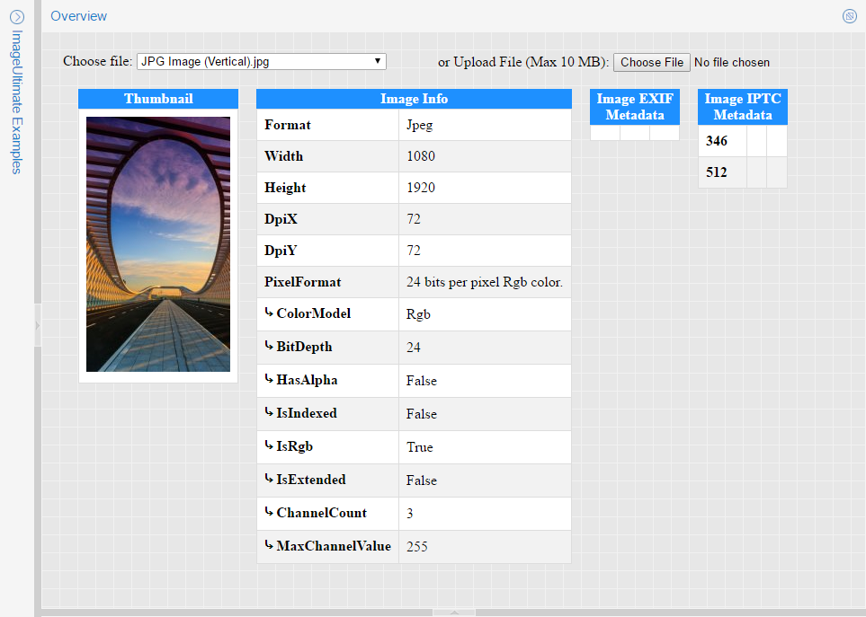

# ImageUltimate: ASP.NET Image Resizer

ImageUltimate is the fastest and easiest ASP.NET image resizer which supports ASP.NET Core 2.0+, ASP.NET MVC 3+ and ASP.NET WebForms 4+ web applications/web sites. ImageUltimate can also be used with .NET Core 2.0+ and .NET Framework 4.0+ console/desktop applications for conversion between several image formats.

- Chain image manipulation commands to get variations in the brink of an eye.

- Keep your source images in their original formats (eg. Psd, Raw) and serve the resulting images in any web format

- Have SEO friendly urls for your images to improve your rankings.

- Vastly reduce your outgoing bandwidth usage with the help of smart versioning.

**Note:** This project contains a fully working version of the product, however without a license key it will run in trial mode. For more information, please see [ImageUltimate: ASP.NET Image Resizer](http://www.gleamtech.com/imageultimate) product page.

### Live Demo:
https://demos.gleamtech.com/imageultimate/

### Adding references to ImageUltimate assemblies:
https://docs.gleamtech.com/imageultimate/html/adding-references-to-imageultimate-assemblies.htm

### Using ImageUltimate in an ASP.NET Core project:
https://docs.gleamtech.com/imageultimate/html/using-imageultimate-in-an-asp-net-core-project.htm

### Using ImageUltimate in an ASP.NET MVC project:
https://docs.gleamtech.com/imageultimate/html/using-imageultimate-in-an-asp-net-mvc-project.htm

### Using ImageUltimate in an ASP.NET WebForms project:
https://docs.gleamtech.com/imageultimate/html/using-imageultimate-in-an-asp-net-webforms-project.htm
